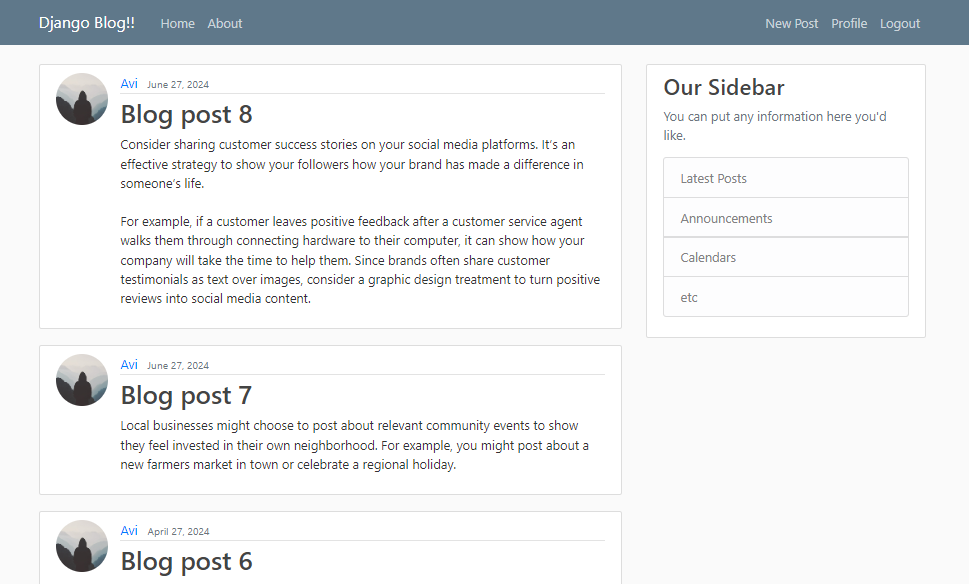

# Django Blog

A blogging website built using the Python web framework Django. Users can register, log in, log out, post blogs, update their profile, and read blogs posted by other users.

## Features
- **User Authentication**: Users can sign up, log in, and log out securely using Django's built-in authentication system.
- **Profile Management**: Users can update their profile information (e.g., username, email, profile picture).
- **Create, Edit, and Delete Blogs**: Users can create blogs, edit or delete them, and read blogs posted by others.
- **Responsive Design**: The website is designed to be responsive and work well on mobile devices.
- **Django Extensions Used**:
  - Django's built-in authentication and user management
  - Django Crispy Forms for better form rendering
  - Django ORM for database interaction
  - Django Messages Framework for flash messages (success/error notifications)

## Installation

### Prerequisites
- Python 3.x installed on your system.
- Virtual environment (recommended for managing dependencies).

### Steps

1. Clone the repository:
   ```bash
   git clone https://github.com/your-username/django-blog.git
   cd django-blog
   ```

2. Create and activate a virtual environment:
   - On Windows:
     ```bash
     python -m venv venv
     venv\Scripts\activate
     ```
   - On Mac/Linux:
     ```bash
     python3 -m venv venv
     source venv/bin/activate
     ```

3. Install the required dependencies:
   ```bash
   pip install -r requirements.txt
   ```

4. Set up environment variables (for development):
   ```bash
   export DJANGO_SETTINGS_MODULE=blog.settings
   export DEBUG=True
   ```

5. Apply database migrations:
   ```bash
   python manage.py migrate
   ```

6. Create a superuser (admin account):
   ```bash
   python manage.py createsuperuser
   ```

7. Run the development server:
   ```bash
   python manage.py runserver
   ```

8. Visit `http://127.0.0.1:8000/` in your web browser.

## Database Setup
1. Run database migrations to set up the tables:
   ```bash
   python manage.py migrate
   ```

2. The SQLite database is now set up and ready to use (you can change the database settings in `settings.py`).

## Project Structure
```
django-blog/
│
├── blog/                 # Main project folder
│   ├── settings.py       # Django settings
│   ├── urls.py           # Main URL configuration
│   ├── wsgi.py           # WSGI entry point
│
├── users/                # User management app (registration, login, profile)
│   ├── models.py         # User models
│   ├── views.py          # User views (profile, registration)
│   ├── forms.py          # Django forms for user updates
│   ├── urls.py           # User URL configuration
│   ├── templates/        # HTML templates for user management
│
├── posts/                # Blog posts app (create, edit, view posts)
│   ├── models.py         # Post models
│   ├── views.py          # Post views (list, create, edit)
│   ├── urls.py           # Post URL configuration
│   ├── templates/        # HTML templates for blog posts
│
├── static/               # Static files (CSS, JS)
├── media/                # Media files (user profile pictures, blog images)
├── manage.py             # Django management script
├── db.sqlite3            # SQLite database (can change in settings)
├── requirements.txt      # Python dependencies
├── README.md             # Project README
```

## Screenshots
### Home Page


## Contributing
Feel free to contribute by opening a pull request or reporting any issues.

## License
This project is licensed under the MIT License - see the [LICENSE](LICENSE) file for details.
